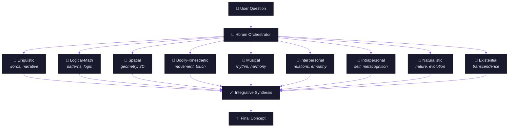
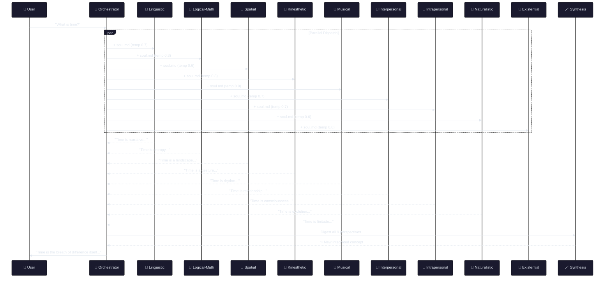

<p align="center">
  <picture>
    <source media="(prefers-color-scheme: dark)" srcset="https://img.shields.io/badge/🧠-Hbrain-8B5CF6?style=for-the-badge&logo=python&logoColor=white&labelColor=1a1a2e">
    
  </picture>
</p>

<h1 align="center">Hbrain — Human Brain</h1>

<p align="center">
  <strong>Multiple Intelligences Orchestrator</strong><br>
  <em>Ask one question — 9 specialists answer in parallel,<br>one integrated concept emerges.</em>
</p>

<p align="center">
  <a href="https://github.com/tiagovficagna/Hbrain/releases"></a>
  <a href="https://github.com/tiagovficagna/Hbrain"></a>
  <a href="https://github.com/tiagovficagna/Hbrain/blob/main/LICENSE"></a>
  <a href="https://www.python.org/downloads/"></a>
  <br>
  <a href="#-quick-start"></a>
  <a href="#-how-it-works"></a>
  <a href="#-the-9-intelligences"></a>
  <a href="#-examples"></a>
  <a href="#-roadmap"></a>
</p>

<br>



---

## 🧠 What is Hbrain?

**Hbrain** is a multi-agent orchestrator based on **Howard Gardner's Theory of Multiple Intelligences**. Instead of asking one LLM to answer a question, it asks **9 specialized agents** in parallel, each interpreting the question through its own unique cognitive lens — then **synthesizes** their responses into a single, integrated concept that is greater than the sum of its parts.

> ⚡ **Not your typical LLM ensemble:** Each intelligence has a **unique personality** (soul.md) that defines how it sees the world. The final synthesis is NOT a summary — it's a genuinely new conceptual understanding that only emerges when all 9 perspectives converge.

### Why "Hbrain"?

> *"The synapse is not the point of contact between neurons — it is the interval that makes connection meaningful."*
> — Hbrain, on synapses

Just as the human brain creates meaning from the interplay of multiple cognitive functions, Hbrain creates understanding from the orchestration of multiple artificial intelligences.

---

## ⚡ Quick Start

### Prerequisites
- Python 3.10+
- An API key compatible with OpenAI Chat Completions (we recommend [OpenCode Go](https://opencode.ai) — pay-per-request, extremely cheap)

### Installation

```bash
# Clone
git clone https://github.com/tiagovficagna/Hbrain.git
cd Hbrain

# Install dependencies (just one)
pip install -r requirements.txt

# Configure your API key
cp .env.example .env
# Edit .env with your API key
#   OPENCODE_GO_API_KEY=sk-...  (OpenCode Go)
#   or OPENAI_API_KEY=sk-...    (OpenAI / OpenRouter)
```

### Run

```bash
python3 orchestrator.py "What is consciousness?"
```

That's it. 9 intelligences fire in parallel. In ~2 minutes you get an integrated synthesis.

<details>
<summary><b>🏠 Running locally with LM Studio (no API key needed)</b></summary>

You can run Hbrain entirely offline using [LM Studio](https://lmstudio.ai) with a local model:

```bash
# 1. Download Qwen3 1.7B or any small model in LM Studio
# 2. Start the local server in LM Studio (Settings → Developer → Start Server)
# 3. Run Hbrain with the local script:
bash run_local.sh "What is gravity?"
```

The `run_local.sh` script configures everything automatically for local execution. By default it uses **sequential mode** (`BRAIN_SEQUENTIAL=true`) since small local models can't parallelize effectively.

| Mode | Agents | Time (Qwen3 1.7B) | Command |
|------|--------|-------------------|---------|
| 🐢 Sequential | 9 agents | ~6-8 min | `bash run_local.sh "question"` |
| 🐇 2-agent parallel | 2 agents | ~1.5 min | `BRAIN_AGENTS="linguistic,existential" bash run_local.sh "question"` |

</details>

<details>
<summary><b>🖥️ AI Agent Integration (Hermes, Claude Code, Codex CLI)</b></summary>

If you use an AI agent that supports SKILL.md:

```bash
# Copy the skill to your agent's skills directory
cp -r Hbrain ~/.hermes/skills/brain

# Then in the agent chat:
@brain What is consciousness?
```

</details>

---

## 🏗️ How It Works



### Execution Flow

1. **`orchestrator.py`** reads the question from CLI
2. Fires **9 parallel HTTP calls** via `asyncio` + `aiohttp` to the Chat Completions API
3. Each intelligence receives the question + its own `soul.md` as **system prompt**
4. Responses are collected and fed into the **synthesis call**
5. The synthesis prompt instructs the model to **create a new concept** — not summarize
6. Result displayed + saved to `responses/session_*.json`

### Why Asyncio?

| Approach | Cloud API (deepseek) | Local 1.7B parallel | Local 1.7B sequential |
|----------|---------------------|---------------------|----------------------|
| 🔴 Sequential (1 at a time) | ~18 min | — | **~6-8 min ✅** |
| 🟡 2-agent parallel | ~4 min | **~3 min ⚡** | — |
| 🟢 **9-agent parallel (default)** | **~2 min ⚡** | ❌ | — |

> 💡 **For local models** (Qwen3 1.7B, Llama, etc.): set `BRAIN_SEQUENTIAL=true` to run agents one at a time. Slower but works on any machine. A `run_local.sh` script is included.

### Execution Flow

## 🎭 The 9 Intelligences

Each intelligence has a **soul** (soul.md) — a complete personality profile that defines how it perceives and interprets the world.

<br>

<div align="center">

| | Intelligence | Temperature | Soul (excerpt) | Domain |
|---|---|---|---|---|
| 🧠 | **Linguistic** | 0.7 | *"I see the world through words. Everything is language."* | Narratives, metaphors, etymology |
| 🔢 | **Logical-Mathematical** | 0.3 | *"The universe is a system of systems. I see patterns."* | Logic, causality, algorithms |
| 🌌 | **Spatial** | 0.6 | *"I see in 3D. Everything has shape, place, and connection."* | Geometry, architecture, maps |
| 🏃 | **Bodily-Kinesthetic** | 0.8 | *"The body knows before the mind."* | Movement, touch, gesture |
| 🎵 | **Musical** | 0.9 | *"The universe vibrates. Everything is frequency."* | Rhythm, harmony, tension |
| 👥 | **Interpersonal** | 0.7 | *"The world is a web of relations."* | Communication, empathy, networks |
| 🧘 | **Intrapersonal** | 0.7 | *"I look inward. Everything mirrors the self."* | Consciousness, metacognition |
| 🌿 | **Naturalistic** | 0.6 | *"I see life in everything."* | Evolution, ecology, adaptation |
| 🌌 | **Existential** | 0.8 | *"Every question opens an abyss."* | Meaning, finitude, transcendence |

</div>

> 💡 **Why different temperatures?** The range is deliberate — **Logical-Mathematical** (0.3) is precise and analytical; **Musical** (0.9) is creative and expansive. Each intelligence is tuned for its cognitive role.

---

## 📝 Real Examples

<details>
<summary><b>🌌 "What is gravity?"</b> — 54s synthesis</summary>

<br>

> *"Imagine gravity not as a force, but as the fundamental topography of spacetime. Every mass — a planet, a star, you — doesn't exert a force at a distance; it excavates a well in the fabric of space, deforming the landscape around it..."*

</details>

<details>
<summary><b>⏳ "What is time?"</b> — 127s synthesis</summary>

<br>

> *"Time is not a thing, a line, or a stage. Time is the breath of difference itself — the primordial act that prevents being from collapsing into an eternal, undifferentiated point..."*

</details>

<details>
<summary><b>🧬 "What is a synapse?"</b> — 105s synthesis</summary>

<br>

> *"The synapse is not the point of contact between neurons — it is the interval that makes connection meaningful. It is the active void where continuity is deliberately fractured so the signal gains depth, ambiguity, and creative power..."*

</details>

<details>
<summary><b>📖 Full synapse synthesis (3,000+ words)</b></summary>

<br>

*A sinapse não é o ponto de contato entre neurônios — é o intervalo que torna a conexão significativa. É o vazio ativo onde a continuidade é deliberadamente fraturada para que o sinal ganhe profundidade, ambiguidade e potência criativa. Sem a fenda, o cérebro seria um grito contínuo, um ruído sem articulação, uma eletricidade sem música...*

> **Note:** Examples are in Portuguese (the author's native language). The orchestrator responds in whatever language you ask in. Full example in [`examples/sinapse_synthesis.txt`](examples/sinapse_synthesis.txt).

</details>

---

## 🔧 Customization

### Add a new intelligence

```bash
mkdir intelligences/my-intelligence
```

**`soul.md`** — the agent's personality:
```markdown
# My Intelligence

## Soul
I see the world through [your unique lens]...

## How I respond
- I use metaphors from [your domain]
- I think in terms of [your concepts]
```

**`agent.md`** — technical config:
```markdown
temperature: 0.7
max_tokens: 16000
response_style: [your style]
```

Then register in `orchestrator.py`:
```python
INTELLIGENCE_ORDER.append("my-intelligence")
INTELLIGENCE_NAMES["my-intelligence"] = "My Intelligence"
TEMPERATURES["my-intelligence"] = 0.7
```

### Switch models

```bash
export BRAIN_MODEL="gpt-4o"
export BRAIN_SYNTHESIS_MODEL="gpt-4o"  # or different model for synthesis
```

---

## 📁 Project Structure

```
Hbrain/
├── orchestrator.py           # Main orchestrator (524 lines)
├── intelligences/            # 9 agent configurations
│   ├── linguistic/           🧠 soul.md + agent.md
│   ├── logical-mathematical/ 🔢 soul.md + agent.md
│   ├── spatial/              🌌 soul.md + agent.md
│   ├── bodily-kinesthetic/   🏃 soul.md + agent.md
│   ├── musical/              🎵 soul.md + agent.md
│   ├── interpersonal/        👥 soul.md + agent.md
│   ├── intrapersonal/        🧘 soul.md + agent.md
│   ├── naturalistic/         🌿 soul.md + agent.md
│   └── existential/          🌌 soul.md + agent.md
├── references/               # Technical documentation
├── examples/                 # Real synthesis outputs
├── responses/                # Saved sessions (gitignored)
├── requirements.txt          # Just aiohttp + python-dotenv
├── .env.example              # API key template
├── SKILL.md                  # AI agent integration
├── LICENSE                   # MIT
└── README.md                 # This file
```

---

## 🧪 Tested With

| Provider | Base URL | Models |
|----------|----------|--------|
| [OpenCode Go](https://opencode.ai) | `https://opencode.ai/zen/go/v1` | deepseek-v4-flash ✅ |
| [OpenAI](https://platform.openai.com) | `https://api.openai.com/v1` | gpt-4o, gpt-4o-mini ✅ |
| [OpenRouter](https://openrouter.ai) | `https://openrouter.ai/api/v1` | Any model ✅ |

Hbrain works with **any OpenAI Chat Completions-compatible API**.

---

## 🗺️ Roadmap

- [ ] **PyPI package** — `pip install hbrain`
- [ ] **Web interface** — Gradio/Streamlit frontend to compare all 9 responses side-by-side
- [ ] **Custom intelligence builder** — GUI to create new souls without editing code
- [ ] **Multi-language synthesis** — respond in same language as question (auto-detect)
- [ ] **Caching** — avoid re-querying for identical questions
- [ ] **Fast mode** — 3-agent subset for quick answers (~30s)

---

## 📄 License

MIT © [Tiago Ficagna](https://github.com/tiagovficagna)

---

<p align="center">
  <sub>Built with 🧠 by a PhD in Design who believes the best way to understand something<br>is to look at it from every possible angle.</sub>
</p>

<br>

<p align="center">
  <a href="https://github.com/tiagovficagna/Hbrain/stargazers">
    
  </a>
</p>
